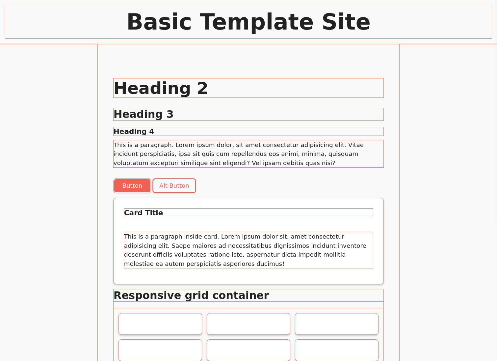

# README - Basic Template

A basic folder structure for simple front-end projects.

## Table of contents

- [Overview](#overview)
  - [Description](#description)
  - [Screenshot](#screenshot)
  - [Links](#links)
- [The process](#the-process)
  - [Built with](#built-with)
  - [Observations](#observations)
  - [Useful resources](#useful-resources)
- [Author](#author)

## Overview

### Description

This is a a basic folder structure for simple front-end projects. Includes minimal styling.

### Screenshot

### Links

- [Repo](https://github.com/je-jo/basic-template)
- [Live Site](https://je-jo.github.io/basic-template/)

## My process

### Built with

- Semantic HTML5 markup
- CSS custom properties
- CSS Grid
- Flexbox
- Mobile-first workflow

### Observations

This template should make building simple pages quicker.

### Useful resources

- [Colors from Paraiso theme](https://github.com/idleberg/Paraiso-Color-Palettes)
- [HTML / Sass Jumpstart](https://github.com/5t3ph/html-sass-jumpstart) - Inspired by Stephanie Eckless' HTML / Sass Jumpstart, but much simpler.

## Author

- [Github](https://github.com/je-jo)
- [Frontend Mentor](https://www.frontendmentor.io/profile/je-jo)
- [Codepen](https://codepen.io/je-jo)
- [Twitter](https://twitter.com/jelena_jo_)